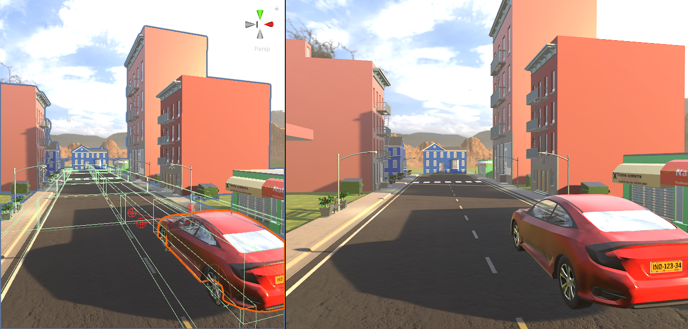

# AI-Car

**Progetto di tirocinio sviluppato da Emmanuel Tesauro.** 
Breve descrizione... 

### Link utili
ML Agents: https://github.com/Unity-Technologies/ml-agents 
[LinkedIn] Emmanuel Tesauro: https://www.linkedin.com/in/emmanuel-tesauro-014244175/ 

### Screenshots

|               Menu                |                Demo             |
|     :---:                         |          :---:                    |
|      |     |

## Demo

|               Menu                |                Demo             |
|     :---:                         |          :---:                    |
|      |     |

<em style="">La grafica globale non è quella definitiva. Ci saranno aggiornamenti per i palazzi, per gli alberi, per l'erba, ecc...</em>
